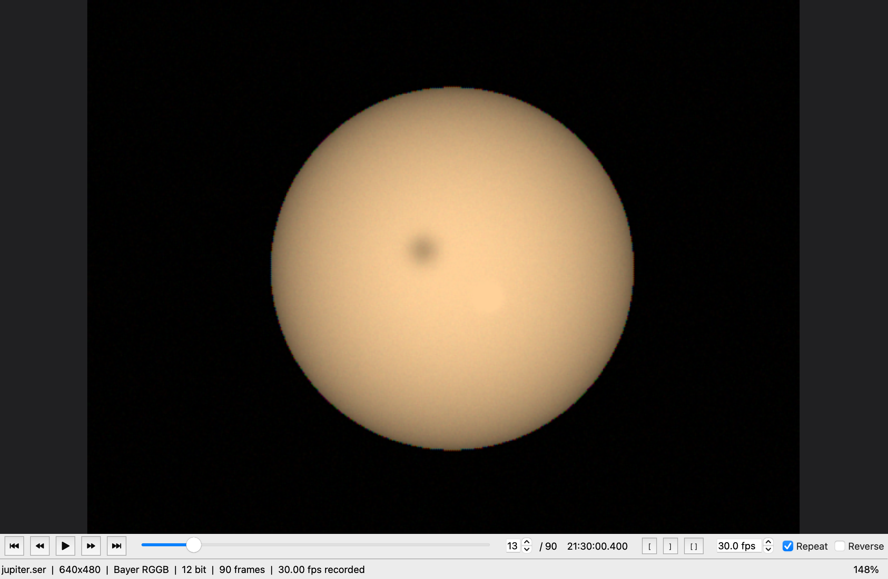
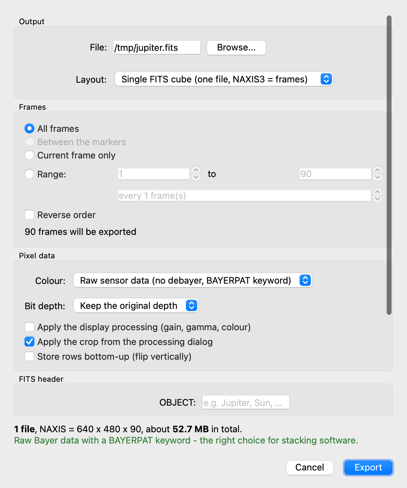
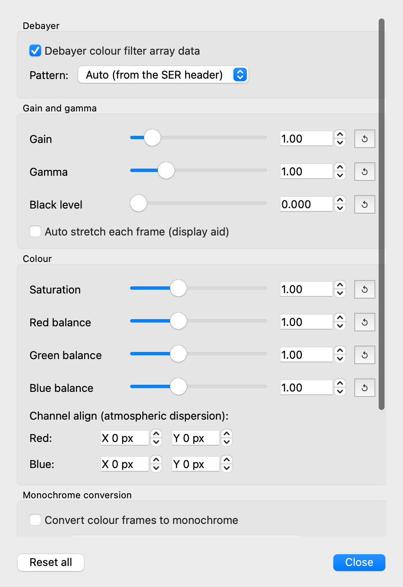
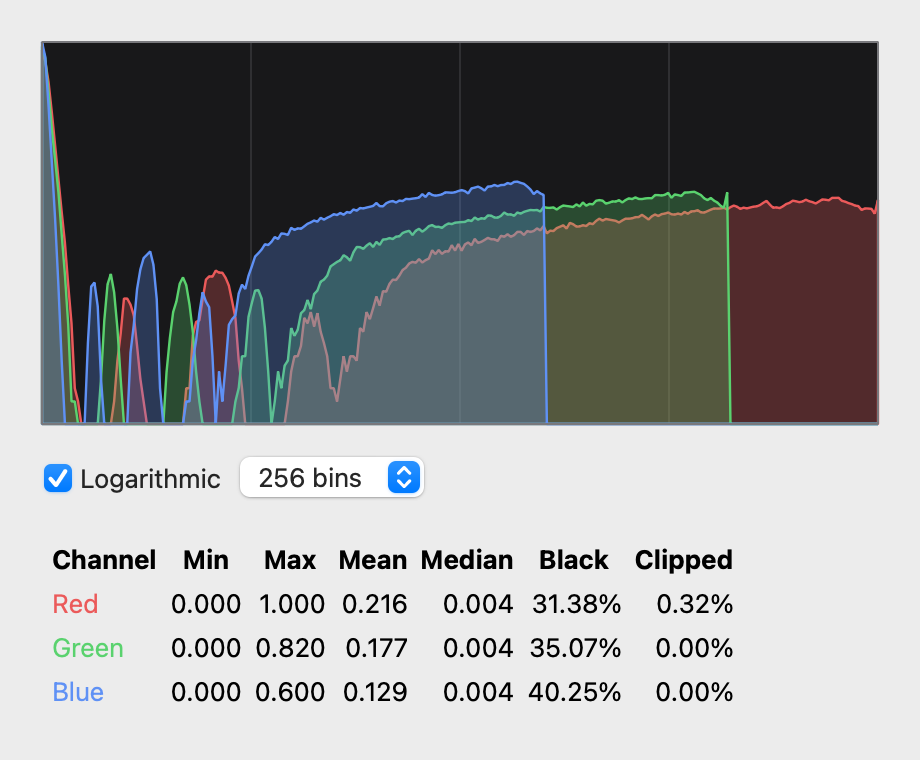

# SER Viewer

天文（太陽・月・惑星）撮像で使われる **SER 動画ファイル**のプレイヤーです。
[SER Player](https://github.com/cgarry/ser-player) の機能に加えて、**FITS 書き出し**を備えています。
macOS と Windows の両方で動作します。



---

## 特徴

### 再生
- SER ファイルの再生・一時停止・コマ送り・逆再生・ループ
- フレームスライダー、フレーム番号入力、フレームごとの UTC タイムスタンプ表示
- 開始／終了マーカー（`[` / `]`）で範囲を指定 → 再生も書き出しもその範囲だけ
- 再生フレームレートの変更（記録された fps を自動で初期値に設定）
- ズーム（5%〜1600%）、ドラッグでパン、ウィンドウに合わせる、等倍表示
- 画素位置と **生の ADU 値**をステータスバーに表示
- ドラッグ＆ドロップでファイルを開く、最近開いたファイル

### 画像処理（表示にリアルタイム反映）
- デベイヤー（RGGB / GRBG / GBRG / BGGR、CMYG 系も近似対応、パターン手動指定可）
- ゲイン、ガンマ、黒レベル、フレームごとのオートストレッチ
- 彩度、RGB カラーバランス
- チャンネルアライン（大気分散補正：R と B を画素単位でシフト）
- モノクロ変換（輝度／平均／R・G・B 単独／2 チャンネル混合）
- 階調反転、左右上下反転、90°単位の回転
- 選択ボックスによるクロップ（ベイヤー位相を壊さないよう偶数座標にスナップ）
- ヒストグラム（RGB 個別、対数表示、min/max/平均/中央値/黒つぶれ・白飛び率）
- SER ヘッダの詳細表示（測定した実効ビット深度、記録 fps、総時間など）

### 書き出し
| 形式 | 内容 |
|---|---|
| **FITS** | 3D キューブ 1 ファイル、または連番ファイル。詳細は下記 |
| 静止画 | PNG / TIFF（8・16 bit）、BMP、JPEG |
| 動画 | AVI（可逆：無圧縮 RGB・FFV1／非可逆：Motion JPEG・MPEG-4）、MP4（H.264） |
| アニメーション GIF | フレーム遅延・最終フレーム遅延・色数・ループ指定 |
| SER | トリミング・クロップした新しい SER ファイル（無処理なら画素値は完全に無劣化） |

---

## FITS 書き出し



### 既定では画素値を一切加工しません
「表示用の処理を適用」を **オフ**（既定）にすると、SER に記録された生の画素値が
そのまま FITS に書かれます。12 bit のカメラなら 0–4095 の値がそのまま残るので、
スタックや測光にそのまま使えます。オンにすると見た目どおりの画像が書き出されますが、
リニアリティは失われます（その旨が HISTORY に記録されます）。

### レイアウト
- **3D キューブ 1 ファイル** — モノクロなら `(フレーム数, 高さ, 幅)`。
  カラーなら `(フレーム数, 3, 高さ, 幅)` の 4 次元になり、1 フレームだけ書き出した
  場合は通常の `(3, 高さ, 幅)` RGB 画像になります。
  フレームごとの時刻は `FRAMETIME` バイナリテーブル拡張（FRAME / MJD_UTC / DATE_OBS）に入ります。
  ディスクへストリーミング書き込みするため、数十 GB の SER でもメモリを消費しません。
- **連番ファイル** — `name_000001.fits`, `name_000002.fits` … AutoStakkert!、
  Registax、Siril、PIPP などのスタックソフトに読ませる場合はこちら。

### カラーの扱い
- **生センサーデータ（デベイヤーなし）** — ベイヤー配列のまま保存し、`BAYERPAT`、
  `XBAYROFF`、`YBAYROFF` を書き込みます。スタック側でデベイヤーするのが定石なので、
  ベイヤーのファイルを開いたときはこれが初期選択になります。
- **デベイヤー後 RGB** — `NAXIS3 = 3`、`CTYPE3 = 'RGB'`。
- **モノクロ** — カラー／ベイヤーをモノクロ化して 1 面で保存。

### ビット深度
`元のまま` / `16 bit 符号なし` / `32 bit 浮動小数点（0.0–1.0 に正規化）`。
符号なし 16 bit は FITS の規約どおり `BZERO = 32768` を付けて保存します。

### 書き込まれる主なヘッダキーワード
| キーワード | 内容 |
|---|---|
| `DATE-OBS` / `MJD-OBS` / `DATE-END` | フレームの UTC 時刻（SER のタイムスタンプ由来） |
| `OBSERVER` / `TELESCOP` / `INSTRUME` | SER ヘッダの値（ダイアログで上書き可） |
| `OBJECT` / `EXPTIME` / `FOCALLEN` / `XPIXSZ` / `YPIXSZ` | ダイアログで任意に入力 |
| `BAYERPAT` / `XBAYROFF` / `YBAYROFF` | 生ベイヤー出力時のみ |
| `ROWORDER` | `TOP-DOWN`（既定）／上下反転時は `BOTTOM-UP` |
| `SERFILE` / `SERFRAME` / `SERCOLID` / `SERDEPTH` / `SERFRAMS` / `NFRAMES` | 元 SER の素性 |
| `HISTORY` | 加工の有無を明記 |

> **行順について**：SER は先頭行が画像の上端です。FITS は本来下端からですが、
> 天文ソフトの多くは `ROWORDER` キーワード（Siril 発祥、PixInsight なども解釈）を見ます。
> 既定では画素を並べ替えずに `ROWORDER = 'TOP-DOWN'` を書きます。
> 上下が逆になるソフトを使う場合はダイアログで「行を下から上に格納」を有効にしてください。

---

## インストール

### ビルド済みバイナリ
[Releases](https://github.com/kiyo-astro/ser-viewer/releases) から取得できます（タグを打つと CI が自動生成します）。

- **macOS** — `SER-Viewer-<版>-macOS-arm64.dmg`（Apple Silicon）または `-x86_64.dmg`（Intel）
  DMG を開いて `SER Viewer.app` を Applications へドラッグします。
  署名なしのため初回は Gatekeeper に止められます。**右クリック →「開く」** を選ぶか、
  「システム設定 → プライバシーとセキュリティ」で「このまま開く」を押してください。
- **Windows** — `SER-Viewer-<版>-windows-x64.zip`
  展開して `SER Viewer.exe` を実行します。SmartScreen が出たら「詳細情報 → 実行」を選びます。

### ソースから実行
```bash
git clone https://github.com/kiyo-astro/ser-viewer.git
cd ser-viewer
python -m venv .venv && source .venv/bin/activate   # Windows: .venv\Scripts\activate
python -m pip install -r requirements.txt
python -m serview            # または: python -m serview path/to/file.ser
```
Python 3.10 以上が必要です。

> **Anaconda / conda 環境では venv を使ってください。**
> conda の OpenCV（`libopencv_highgui`）は conda 版 Qt6 をロードするため、
> pip の PySide6 が持つ Qt6 と二重に読み込まれ、同じ Qt クラスが 2 つ存在する状態に
> なります。この状態では操作中にランダムに落ちます（実測で 3〜4 回に 1 回ほど）。
> `pip install opencv-python-headless` を入れた venv では発生しません。
> 配布用のビルド済みアプリは自前の Qt しか持たないため影響を受けません。

---

## 使い方

| 操作 | ショートカット |
|---|---|
| ファイルを開く | `Ctrl/Cmd + O` |
| 再生／一時停止 | `Space`（画像のダブルクリックでも可） |
| 前後のフレーム | `←` / `→` |
| 10 フレーム移動 | `PageUp` / `PageDown` |
| 最初／最後のフレーム | `Home` / `End` |
| 開始／終了マーカー | `[` / `]`（解除は `Ctrl + [`） |
| 拡大／縮小 | `Ctrl/Cmd + +` / `-` |
| 等倍／ウィンドウに合わせる | `Ctrl/Cmd + 1` / `Ctrl/Cmd + 0` |
| 選択ボックスモード | `Ctrl/Cmd + B` |
| 処理ダイアログ | `Ctrl/Cmd + P` |
| ヒストグラム | `Ctrl/Cmd + H` |
| ファイル詳細 | `Ctrl/Cmd + I` |
| FITS 書き出し | `Ctrl/Cmd + E` |
| 画像・動画・SER 書き出し | `Ctrl/Cmd + Shift + E` |

**クロップの指定**：処理ダイアログの「Use selection box」を押す → 画像上をドラッグ、
または `Ctrl/Cmd + B` で選択モードにしてドラッグします。

**ダイアログの大きさ**：処理・FITS 書き出し・フレーム書き出しの各ダイアログは、
起動時に画面の高さに収まるよう自動で縮み、中身はスクロールします。
ボタン（Export / Close など）は常に下端に固定されるので、
ノート PC の画面でも押せなくなることはありません。





## うまくいかないときは

| 症状 | 対処 |
|---|---|
| 画面が真っ暗／極端に暗い | 処理ダイアログの「Auto stretch each frame」を有効にするか、ゲイン・ガンマを上げます。ヘッダのビット深度が誤っているファイルは自動補正しますが、実データが暗い場合は手動調整が要ります |
| 色が不自然・市松模様に見える | ベイヤーパターンの自動判定が合っていない可能性があります。処理ダイアログの Pattern で RGGB / GRBG / GBRG / BGGR を切り替えてください |
| 他のソフトで FITS の上下が逆になる | FITS 書き出しで「Store rows bottom-up」を有効にしてください |
| スタックソフトが色を認識しない | 「Raw sensor data」で書き出すと `BAYERPAT` が付きます。デベイヤー後の RGB では付きません |
| macOS で「開発元を確認できません」 | アプリを右クリックして「開く」を選ぶか、システム設定 → プライバシーとセキュリティで許可します |
| ソースから実行すると突然落ちる／`Class Qt... is implemented in both` と表示される | Qt が二重にロードされています。conda 環境ではなく venv で実行してください（上記「ソースから実行」参照） |

---

## 対応する SER フォーマット

| 項目 | 対応内容 |
|---|---|
| ColorID | MONO(0)、ベイヤー RGGB/GRBG/GBRG/BGGR(8–11)、CYYM/YCMY/YMCY/MYYC(16–19)、RGB(100)、BGR(101) |
| ビット深度 | 1–8 bit（1 バイト/画素）、9–16 bit（2 バイト/画素） |
| バイト順 | リトルエンディアン、ビッグエンディアン（`LittleEndian = 1` が**ビッグ**エンディアンを意味する仕様のクセに対応） |
| タイムスタンプ | 末尾のフレーム別タイムスタンプに対応。UTC でなくローカル時刻で記録されている場合は自動判別して補正 |
| 実効ビット深度 | ヘッダの `PixelDepthPerPlane` を鵜呑みにせず、実データを走査して本当の深度（10/12/14 bit など）を測定し、表示の明るさを補正 |
| 壊れたファイル | ヘッダのフレーム数が実ファイルより多い場合は読める範囲に切り詰めて警告表示 |

---

## 開発

```bash
python -m pip install -r requirements-dev.txt
QT_QPA_PLATFORM=offscreen pytest -q      # 44 件のテスト
```

テスト用の SER ファイルは合成できます:
```bash
python tests/tools/make_test_ser.py /tmp/test.ser --width 640 --height 480 \
    --frames 90 --depth 12 --colour BAYER_RGGB
```

### 動作確認用のセルフテスト
```bash
python -m serview --selftest
# 配布物に対しても実行できます
"./dist/SER Viewer.app/Contents/MacOS/SER Viewer" --selftest
"dist\SER Viewer\SER Viewer.exe" --selftest
```
一時ファイルに SER を書き出して読み戻し、デベイヤー・FITS 書き出し・PNG 書き出し・
オフスクリーンでの GUI 起動まで一通り実行します。ビルド済みアプリでライブラリや Qt
プラグインの同梱漏れがあればここで失敗するので、CI でもビルド後に必ず実行しています
（実際、開発中に astropy のデータファイル漏れをこれで 2 件検出しました）。

### 配布物のビルド
```bash
./packaging/build_macos.sh --venv     # macOS: "dist/SER Viewer.app" と DMG
packaging\build_windows.bat --venv    # Windows: "dist\SER Viewer\SER Viewer.exe" と zip
```
`--venv` を付けると使い捨ての仮想環境を作ってビルドします（普段の環境の余計な
ライブラリが混入しないので推奨）。

### CI
`.github/workflows/build.yml` が以下を実行します。
1. Ubuntu / macOS / Windows でテスト
2. macOS（arm64・x86_64）と Windows（x64）の配布物をビルドし、起動確認
3. `v*` のタグを push したときは Release を作成して DMG と zip を添付

### パッケージングの注意点
- `packaging/pyinstaller_hooks/hook-astropy.py` で astropy 用の標準フックを
  差し替えています。標準フックは `collect_submodules("astropy")` を呼ぶため
  `astropy.visualization.wcsaxes` を import してしまい、matplotlib の無い
  ビルドマシンでは**ビルド自体が失敗**します。
- ビルドは必ず `--venv`（または CI のようなクリーンな環境）で行ってください。
  普段使いの Anaconda 環境などでビルドすると pandas・pyarrow・別系統の Qt が
  紛れ込み、バンドルが数百 MB 肥大化したうえ Qt が二重ロードされます。

### 構成
```
serview/
├── ser/          SER の読み書き（format.py / reader.py / writer.py）
├── imaging/      デベイヤー・階調・色処理・ヒストグラム
├── export/       fits.py / images.py / video.py / ser.py
└── ui/           Qt (PySide6) の画面
```

---

## 開発・謝辞

Application developed by Kiyoaki Okudaira - Kyushu University Hanada Lab
(Space Systems Dynamics)

Supported by JSPS KAKENHI Grant Number JP26H02172.

## ライセンス

MIT License。

SER Player（Chris Garry 作、GPL-3.0）に着想を得ていますが、コードは流用せず
新規に実装しています。SER フォーマットの仕様は Heiko Wilkens / Grischa Hahn による
公開仕様書に基づきます。
PySide6 / Qt、NumPy、OpenCV、Astropy、Pillow を使用しています。
